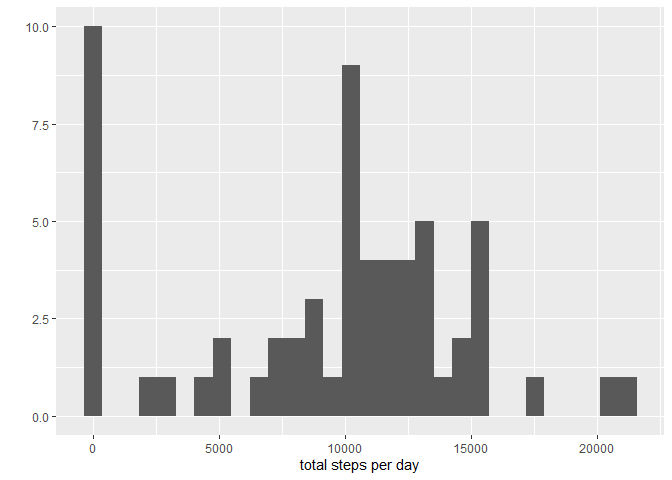

## Used packages in this programming assignment are loaded into the library

```r
library(dplyr)
library(ggplot2)
```


## Loading and preprocessing the data
The data is unzipped, loaded into R Studio. For an overview to assess the data, the summary is depicted. The date column set as a Date format. This is controlled by checking the structure of the data.

```r
unzip("activity.zip")
data <- read.csv("activity.csv")
summary(data)
```

```
##      steps            date              interval     
##  Min.   :  0.00   Length:17568       Min.   :   0.0  
##  1st Qu.:  0.00   Class :character   1st Qu.: 588.8  
##  Median :  0.00   Mode  :character   Median :1177.5  
##  Mean   : 37.38                      Mean   :1177.5  
##  3rd Qu.: 12.00                      3rd Qu.:1766.2  
##  Max.   :806.00                      Max.   :2355.0  
##  NA's   :2304
```

```r
data$date <- as.Date(data$date, "%Y-%m-%d")
str(data)
```

```
## 'data.frame':	17568 obs. of  3 variables:
##  $ steps   : int  NA NA NA NA NA NA NA NA NA NA ...
##  $ date    : Date, format: "2012-10-01" "2012-10-01" ...
##  $ interval: int  0 5 10 15 20 25 30 35 40 45 ...
```

## What is mean total number of steps taken per day?
A new dataframe is generated by grouping the data with the **dyplr** package for the dates and summarising all the steps of each day. The according histogram plot shows the distribution of the *total steps per day*, meaning how often certain total daily step counts occur.

```r
data_total <- data %>% 
  group_by(date) %>%
  summarise(steps = sum(steps, na.rm = TRUE))

qplot(data_total$steps, geom="histogram", xlab = "total steps per day", bins = 30)
```

<!-- -->

The mean and median of the *total steps per day* are very similar.

```r
mean_steps <- mean(data_total$steps, na.rm=TRUE)
median_steps <- median(data_total$steps, na.rm=TRUE)
mean_steps
```

```
## [1] 9354.23
```

```r
median_steps
```

```
## [1] 10395
```

## What is the average daily activity pattern?
A new dataframe is generated, where the 5-minute intervals are numbered from 1 to 288. The dataframe is grouped by the intervals and the *mean total steps averaged over all days* are calculated. The resulting time series plot shows the averaged daily activity pattern.

```r
data_activity <- data %>% 
  group_by(date) %>%
  mutate(interval = 1:n()) %>%
  group_by(interval) %>%
  summarise(steps = mean(steps, na.rm = TRUE))

ggplot(data_activity, aes(x = interval, y = steps)) + geom_line()
```

<!-- -->

The interval with the *highest step count averaged over all days* is calculated.

```r
max_interval <- c(data_activity[[which.max(data_activity$steps),1]])
max_interval
```

```
## [1] 104
```

## Imputing missing values
To assess the amount of missing values, the total number of rows with NA's in the *steps* column is calculated.

```r
total_na <- sum(is.na(data$steps))
total_na
```

```
## [1] 2304
```

The missing values will be filled with the mean step count for that 5-minute interval averaged over all days. Therefore a dataframe of the *mean steps averaged over all days* for each interval is generated (see **What is the average daily activity pattern?**)

```r
mean_interval <- data %>% 
  group_by(date) %>%
  mutate(interval_day = 1:n()) %>%
  group_by(interval_day) %>%
  summarise(steps = mean(steps, na.rm = TRUE))
```

A corrected dataframe is generated, where the NA's are filled up with the mean values for this interval averaged over all days.

```r
data_corr <- data %>%
  group_by(date) %>%
  mutate(mean = mean_interval$steps) %>%
  mutate(steps = coalesce(steps, mean)) %>%
  select(-mean)
```

Finally the dataframe to depict in a histogram is generated, calculating the *total steps per day*.

```r
data_total2 <- data_corr %>% 
  group_by(date) %>%
  summarise(steps = sum(steps, na.rm = TRUE))

qplot(data_total2$steps, geom="histogram", xlab = "total steps per day", bins = 30)
```

<!-- -->

The mean and median of the *total steps per day* are now identical. Before, the mean was much lower, caused by the many missing values in the dataframe. The new median from the filled dataframe increased compared to the one from the dataframe with missing values. The amount of zero steps per day decreased and tributed to the increase of the mean and median.

```r
mean_steps2 <- mean(data_total2$steps, na.rm=TRUE)
mean_steps2
```

```
## [1] 10766.19
```

```r
median_steps2 <- median(data_total2$steps, na.rm=TRUE)
median_steps2
```

```
## [1] 10766.19
```

## Are there differences in activity patterns between weekdays and weekends?
Since I am german speaking and my week days sound much different, I adjust the system language to english.

```r
Sys.setlocale("LC_TIME", "C")
```

```
## [1] "C"
```

```r
format(Sys.Date(), "%Y-%b-%d")
```

```
## [1] "2020-Nov-19"
```

Again, as for the question **Imputing missing values**, the original data is corrected and NA's filled up with the mean step count averaged over the intervals for each day.

```r
mean_interval <- data %>% 
  group_by(date) %>%
  mutate(interval_day = 1:n()) %>%
  group_by(interval_day) %>%
  summarise(steps = mean(steps, na.rm = TRUE))

data_corr2 <- data %>%
  group_by(date) %>%
  mutate(mean = mean_interval$steps) %>%
  mutate(steps = coalesce(steps, mean)) %>%
  select(-mean)
```

Then, a vector for the weekdays is created and a factor column added to the dataframe. The weekday of the date is checked if it's included in the weekdays1 vector. If it is, the factor is set to weekday. If it's not included, the factor is set to weekend.

```r
weekdays1 <- c('Monday', 'Tuesday', 'Wednesday', 'Thursday', 'Friday')

data_corr2$wDay <- factor((weekdays(data_corr2$date) %in% weekdays1), 
                   levels=c(TRUE, FALSE), labels=c('weekday', 'weekend'))
```

Again a dataframe is generated for the activity pattern plot. For each interval numbered from 1 until 288, the mean steps averaged over the indicated days (now grouped additionally by the factor *weekend* or *weekday*) are calculated. When plotting the activity pattern fro the *weekday* compared to the *weekend*, it is visible that there is around the interval 100 a bigger peak of activity.

```r
data_week <- data_corr2 %>%
  group_by(date) %>%
  mutate(interval = 1:n()) %>%
  group_by(wDay, interval) %>%
  summarise(steps = mean(steps, na.rm = TRUE), wDay = wDay, date = date) %>%
  arrange(date)

data_week$wDay <- as.factor(data_week$wDay)

ggplot(data_week, aes(x = interval, y = steps)) + geom_line() + facet_grid(wDay~.)
```

<!-- -->
